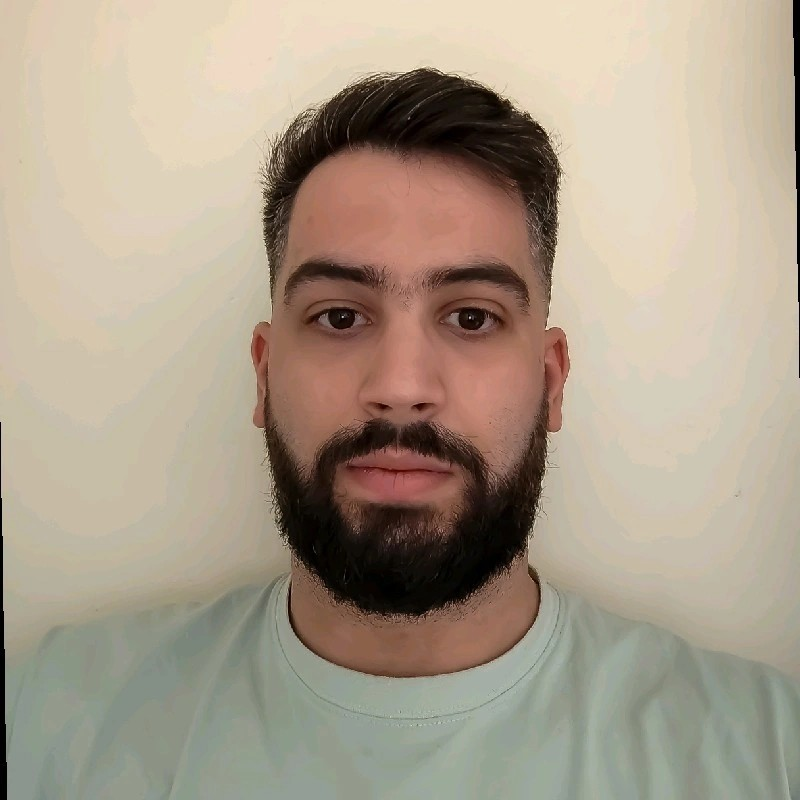

  

    <h3>Mateo Rubati</h3>
    
<strong>Email:</strong> rubatimateo@gmail.com

    
<strong>LinkedIn:</strong> <a href="https://www.linkedin.com/in/mateo-rubati-b832aa214/" target="_blank">Mateo Rubati</a>

    
<strong>GitHub:</strong> <a href="https://github.com/MateoRbt" target="_blank">MateoRbt</a>

  

  

## Summary  
AI Engineer and Data Scientist with an Integrated Master’s in Computer Science and current MSc candidate in Artificial Intelligence and Visual Computing. Proficient in Python, PyTorch, TensorFlow, and Scikit-learn, with expertise in machine learning, computer vision, and NLP. Experienced in full-stack development (MERN stack) and building scalable AI-driven solutions. Achieved top performance in NLP (grade: 10) and Deep Learning (grade: 9.1) courses, with projects like FinBERT sentiment analysis and ResNet-18 image classification yielding up to 20% performance gains. Passionate about applying cutting-edge AI research and collaborating in agile teams.

## Experience  
### **Full-Stack Developer** | EnableGood *(March 2023 - October 2024)*  
- Developed **RESTful APIs** using **Node.js and Express**.  
- Implemented **role-based authentication** using **JWT**, enhancing security for user access.  
- Worked with **React.js** for dynamic front-end development.  

## Education  
### **Integrated Master’s (MEng) in Computer Science (BSc + MSc Equivalent)** | **Uniwa**  
- ***Graduated:*** September 2023  
- Relevant coursework: **Data Structures, Algorithms, AI, Software Development, Database Systems**  
- *Thesis:* **"Formal Methods for Filesystem Standardization"** - Used **TLA+** for Ext2 specification.  
- ***Link:*** [Code](https://github.com/MateoRbt/EXT2-file-system-standarization) , [Paper](https://www.academia.edu/127711289/%CE%A0%CE%91%CE%9D%CE%95%CE%A0%CE%99%CE%A3%CE%A4%CE%97%CE%9C%CE%99%CE%9F_%CE%94%CE%A5%CE%A4%CE%99%CE%9A%CE%97%CE%A3_%CE%91%CE%A4%CE%A4%CE%99%CE%9A%CE%97%CE%A3_%CE%A3%CE%A7%CE%9F%CE%9B%CE%97_%CE%9C%CE%97%CE%A7%CE%91%CE%9D%CE%99%CE%9A%CE%A9%CE%9D_%CE%A4%CE%9C%CE%97%CE%9C%CE%91_%CE%9C%CE%97%CE%A7%CE%91%CE%9D%CE%99%CE%9A%CE%A9%CE%9D_%CE%A0%CE%9B%CE%97%CE%A1%CE%9F%CE%A6%CE%9F%CE%A1%CE%99%CE%9A%CE%97%CE%A3_%CE%9A%CE%91%CE%99_%CE%A5%CE%A0%CE%9F%CE%9B%CE%9F%CE%93%CE%99%CE%A3%CE%A4%CE%A9%CE%9D_%CE%94%CE%99%CE%A0%CE%9B%CE%A9%CE%9C%CE%91%CE%A4%CE%99%CE%9A%CE%97_%CE%95%CE%A1%CE%93%CE%91%CE%A3%CE%99%CE%91_%CE%A0%CE%A1%CE%9F%CE%A4%CE%A5%CE%A0%CE%9F%CE%A0%CE%9F%CE%99%CE%97%CE%A3%CE%97_%CE%A4%CE%9F%CE%A5_%CE%A3%CE%A5%CE%A3%CE%A4%CE%97%CE%9C%CE%91%CE%A4%CE%9F%CE%A3_%CE%91%CE%A1%CE%A7%CE%95%CE%99%CE%A9%CE%9D_EXT2_%CE%9C%CE%95_%CE%A7%CE%A1%CE%97%CE%A3%CE%97_%CE%A4%CE%A5%CE%A0%CE%99%CE%9A%CE%A9%CE%9D_%CE%9C%CE%95%CE%98%CE%9F%CE%94%CE%A9%CE%9D_%CE%A1%CE%BF%CF%85%CE%BC%CF%80%CE%AC%CF%84%CE%B9_%CE%9C%CE%B1%CF%84%CE%AD%CE%BF)  

### **Master of Science (MSc) in Artificial Intelligence and Visual Computing** | **Uniwa**  
- ***Currently Attending***  
- Studying advanced AI topics, including **Machine Learning, Deep Learning, Computer Vision and Data Science**.  
- Worked on various projects, including **Sentiment Analysis and Image Processing**, applying AI techniques to real-world problems.  

## Skills  
### **Programming Languages:**  
Python, C, C++, JavaScript, Matlab  
### **Frameworks & Libraries:**  
MERN Stack, Scikit-Learn, PyTorch, TensorFlow  
### **Databases:**  
SQL, MongoDB, PostgreSQL  
### **Tools & Technologies:**  
Docker, Git, Linux, Bash  
### **Other:**  
CMS, SEO, Technical Documentation, Prompt Engineering, Video/Photo Editing

### Collaboration & Teamwork  
- Worked in **cross-functional teams** during my time at EnableGood, collaborating with developers, designers, and project managers to deliver scalable web applications.  
- Engaged in **team-based projects** throughout my undergraduate and master's studies, collaborating with peers on AI, machine learning, and software development tasks.  
- Experience in **research collaboration**, working with fellow AI students on projects involving sentiment analysis, computer vision, and deep learning.  
- Comfortable with **agile workflows**, Git-based collaboration, and peer code reviews.  

## Projects  
### **1. C++ Dungeon Crawler Game**  
- ***Description:*** A mini C++ game made with **ncurses**.  
- ***Stack:*** C++, ncurses, CMake  
- ***Link:*** [GitHub](https://github.com/MateoRbt/Cpp-Project)  

### **2. Sentiment Analysis on Financial News**  
- ***Description:*** A **sentiment analysis** project for **financial news classification**.  
- ***Stack:*** Python, Scikit-Learn, PyTorch  
- ***Models:*** Logistic Regressor, SVM, LSTM, CNN  
- ***Link:*** [GitHub](https://github.com/MateoRbt/Sentiment-Analysis/blob/master/Sentiment-Analysis.pdf) ,[Kaggle](https://www.kaggle.com/code/mateorbt/sentiment-analysis-deep-learning)

### **3. Home Server Project**  
- ***Description:*** A **personal homelab project** involving self-hosted services.  
- ***Stack:*** Docker, Linux  
- ***Link:*** [GitHub](https://github.com/MateoRbt/HomeServer)

### **4. Sentiment Analysis με FinBERT, MLP & BiLSTM**
- ***Description:*** Multi-class sentiment analysis on financial texts using FinBERT fine-tuning, FinBERT embeddings with MLP, and BiLSTM with Focal Loss.  
- ***Stack:*** PyTorch, Transformers (Huggingface), FinBERT, SMOTE, NLTK, scikit-learn, Focal Loss, Matplotlib, NumPy, Pandas  
- ***Link:*** [GitHub](https://github.com/MateoRbt/Sentiment-Analysis-FinBERT)

### **5. Image Classification με ResNet-18 & ShuffleNet v2 (CIFAR-100)**
- ***Description:***  Benchmarking ResNet-18 and ShuffleNet v2 on CIFAR-100 with reduced training data (70%, 60%, 50%) to compare performance under data scarcity.  
- ***Stack:*** PyTorch, Torchvision, ResNet, ShuffleNet v2, CIFAR-100, NumPy, Matplotlib, scikit-learn  
- ***Link:*** [GitHub](https://github.com/MateoRbt/cifar100-pytorch)

### **6. Large-Scale Data Collection, Processing & Visualization (Financial News & Market Data)**
- ***Description:***  A full pipeline for collecting, analyzing, and visualizing financial news and market data using NLP, sentiment analysis, topic modeling, and BI tools.  
- ***Stack:*** Python, BeautifulSoup, newspaper3k, FinBERT, KeyBERT, BERTopic, yfinance, MySQL, SQLAlchemy, Power BI, Pandas, scikit-learn  
- ***Link:*** [GitHub](https://github.com/MateoRbt/Large-Scale-Data-Management-and-Visualization)

## Awards & Recognitions  
- **Top Student in High School** – *1st Technical Highschool of Athens* (2016) – Recognized for academic excellence and consistently being among the top students in the graduating class.
- **Top Student** in Natural Language Processing, University of West Attica, 2024 (Grade: 10/10)  
- **Top Student** in Deep Learning, University of West Attica, 2025 (Grade: 9.1/10)  
- **International Open Bidding Competition** – *Europe* (2019) – Collaborated with a diverse team of university students across Europe to develop a website providing information on immigration. Contributed to the development of the **database**, ensuring data accuracy and efficient retrieval.

### Hobbies & Interests  
- 🏋️‍♂️ **Fitness & Strength Training** – Discipline, goal-setting, and perseverance.  
- ♟️ **Chess** – Strategic thinking, problem-solving, and decision-making.  
- 📚 **Reading** – Interests in popular science, literature, and philosophy.  
- 📈 **Investing** – Stock market and cryptocurrency investments, financial analysis.  
- 💻 **Programming & Homelab** – Personal coding projects and self-hosted server management.  
- 🌍 **Worldbuilding** – Creating fictional universes, exploring history, mythology, and speculative fiction.  
